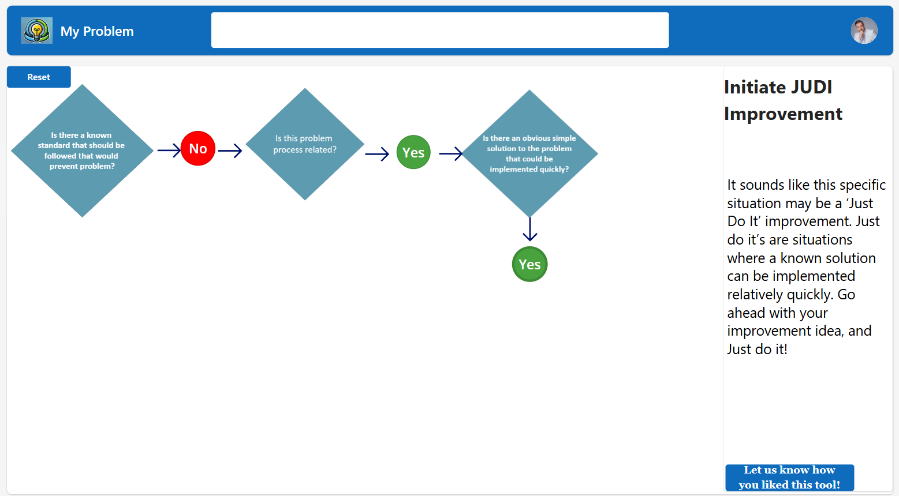

# 🧭 Problem Decision Tool

The **Problem Decision Tool** is a Power Platform-based triage app that helps users categorize problems and determine the appropriate level of intervention. Whether an issue is best suited for a **Just Do It**, **RPIW**, **Yellow Belt**, or **Green Belt** project, this app guides users through a consistent, structured decision-making process.

---

## 🔍 Purpose

This tool was designed to help teams and leaders:

- Quickly assess the scale and complexity of a problem  
- Reduce ambiguity when deciding whether to escalate an issue  
- Align problems with appropriate Lean or PI tools  

---

## ⚙️ Features

- Dynamic questions based on selected issue type  
- Built-in logic that evaluates scope, risk, urgency, and control  
- Recommends a decision path (e.g., Yellow Belt or Green Belt)  
- Allows saving/exporting of decisions  
- Works on both mobile and desktop  

---

## 📊 Decision Logic

The tool asks questions like:

- Is the root cause known?  
- Is it isolated to one area or cross-functional?  
- Does it involve safety, compliance, or major impact?  
- How much effort would it take to address?  

Based on scoring logic, it recommends one of these:

- 🛠️ **Just Do It** – Quick, low-effort fix  
- 🟡 **Yellow Belt** – Moderately scoped issue needing structure  
- 🚀 **RPIW** – Workflow needs redesign via workshop  
- 🟢 **Green Belt** – Larger data-driven problem-solving effort  

---

## 🧠 Tech Stack

- Power Apps Canvas App  
- SharePoint list or Dataverse backend  
- Conditional logic using `Switch()`, `If()`, `Score`, and `Patch()`  

---

## 📸 Screenshot

---

## 📁 Repo Structure

